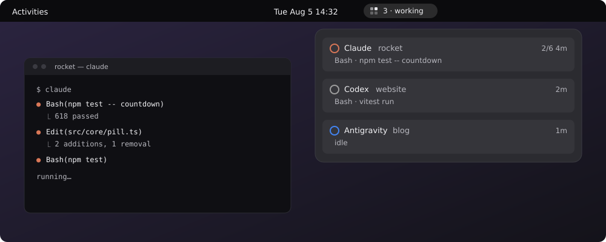

<div align="center">

<picture>
  <source media="(prefers-color-scheme: dark)" srcset="src/assets/logo-dark.svg">
  
</picture>

# Dasbo Island

**Your AI coding agents, live on the GNOME top bar.**

[](https://github.com/dasbo-dev/island-gnome/actions/workflows/ci.yml)
[](LICENSE)
[](https://release.gnome.org/46/)

[Live demo](https://fsevenm.github.io/dasbo-island/) ·
[Agent dialects](docs/agent-dialects.md) ·
[Limitations](docs/limitations.md) ·
[Contributing](CONTRIBUTING.md) ·
[Changelog](CHANGELOG.md)

</div>



<sub>A mockup, not a screen capture — the extension drawn as it appears. <a href="https://fsevenm.github.io/dasbo-island/">The live demo</a> runs the real state machine in your browser.</sub>

## What it is

Dasbo Island is a GNOME Shell extension that keeps every live AI coding-agent
session in the top bar: status at a glance, permission prompts answered
inline, and one click back to the terminal running the work.

The demo linked above is not a video. It is the extension's own `src/core`
state machine, bundled for the browser.

Source: [github.com/dasbo-dev/island-gnome](https://github.com/dasbo-dev/island-gnome)

## Contents

- [Features](#features)
- [Requirements](#requirements)
- [Install](#install)
- [How it works](#how-it-works)
- [Supported agents](#supported-agents)
- [Fail-open guarantee](#fail-open-guarantee)
- [Status and known limitations](#status-and-known-limitations)
- [Development](#development)
- [Contributing](#contributing)
- [License](#license)
- [Credits](#credits)

## Features

- **Status at a glance.** A pill in the top bar reflects the busiest session —
  working, waiting on you, errored, or finished — without opening anything.
- **Answer permissions where you are.** A tool waiting for approval can be
  allowed or denied from the popup, without switching to the terminal.
- **One click back to the terminal.** Every session row knows the terminal
  running it and raises that window.
- **Every agent in one place.** Claude Code, Codex CLI, and Antigravity CLI
  sessions share the pill, each row led by a chip naming the agent.
- **Task-list progress.** When an agent keeps a task list, its row shows how
  far through it is and expands to the list itself.
- **Cues you can hear.** A permission request, a question, a notification, and
  a finished session each get their own sound from your desktop's sound theme.

## Requirements

- GNOME Shell 46
- X11 or Wayland

## Install

```bash
make install
gnome-extensions enable dasbo-island@ayubaswad.gmail.com
```

Then reload the shell. On X11 press `Alt`+`F2`, type `r`, press `Enter`. On
Wayland, log out and back in.

Open the preferences and install the hooks for each agent you use:

```bash
gnome-extensions prefs dasbo-island@ayubaswad.gmail.com
```

Whenever the pill is visible, the preferences window is one click away: click
the pill, then the gear in the popup's header. The pill stays hidden while no
session is running unless you enable **Always show the pill**.

> [!IMPORTANT]
> **Codex CLI needs one more step.** Installing the hooks is not enough on its
> own. Codex will not run a hook it has not been told to trust: it stores that
> decision per hook config, and the review that grants it happens only in
> Codex's own interactive TUI. After Install (or Update), start `codex` once
> and approve the hook review. Until you do, the hooks sit in the file and
> never fire, and no Codex session reaches the island.

Hook installation preserves entries belonging to other tools and writes a
`.dasbo.bak` backup before its first change.

## How it works

The pill shows a 2×2 grid that reflects the busiest session: three blocks dim
with one slowly breathing at rest, a light travelling clockwise while an agent
works, all four blocks blinking together when a permission needs your answer,
a static diagonal pair on error, and a green stagger when a session finishes.

Each session row is led by a chip naming the agent doing the work, so a popup
holding a Claude Code session beside a Codex one says which is which at a
glance. **Agent chip** in the preferences chooses what it shows: the mark
alone, the mark and a short name, or the name alone. A row whose mark is
missing shows the name whatever that says. The marks are drawn for this
extension rather than taken from each vendor, and they do not recolour with a
light or dark theme.

Each agent row shows whether its hooks are installed. If the extension
directory moves, or a release adds a hook event the installed set is missing,
the row offers **Update** — every installed hook command embeds an absolute
path, and an install written before a new event existed is out of date.

When an agent keeps a task list, its row shows how far through it is — `3/10`
beside the clock — and the expander arrow opens the list itself, one line per
task: `✓` done, `▸` in progress, `○` still to do. Claude Code's list is read
from `~/.claude/tasks/<session-id>/`, so it appears without any extra hook.
`/clear` starts a fresh list, because it starts a fresh session id.

When an agent says it is waiting on you — Claude raises this after its prompt
has sat idle, and for any permission the island did not answer itself — the
message appears on that session's row and the popup opens to show it. Both
revert a few seconds later, and a popup you opened yourself is never closed
for you. The delay, and whether the popup opens at all, are in the
preferences; set the delay to zero to keep the message on the row until the
agent does something else, and to keep a popup it opened staying open until
you close it yourself.

Each of those moments also makes a sound: a permission request, an agent's
question, a notification, and a session finishing, each with its own cue. The
sounds come from your desktop's sound theme rather than from this extension,
so they match everything else on the system, and they stay silent when GNOME's
own event sounds are off. Unlike the popup, sound is not suppressed by a
fullscreen window — that is when the pill is least visible and the sound is
most useful. One switch in the preferences turns all four off. GNOME's Do Not
Disturb silences GNOME's own notification sounds, not these cues — the island
is not a notification service, and a blocked agent is waiting on you either
way.

Panel box and position changes apply immediately, with no reload. Extensions
that replace the top bar, such as Dash to Panel, decide where each box ends up
on screen.

## Supported agents

| Agent | Config touched | Status reporting | Permission gating |
|---|---|---|---|
| Claude Code | `~/.claude/settings.json` | 17 real hook-payload fixtures | yes |
| Codex CLI | `~/.codex/hooks.json` | 6 real fixtures (0.146.0) | no — [notify-only](docs/limitations.md#codex-has-no-permission-gate) |
| Antigravity CLI (`agy`) | `~/.gemini/config/hooks.json` | 12 real fixtures | [unverified](docs/limitations.md#the-antigravity-permission-gate-may-fail-open) |

Payload shapes for all three are documented in
[docs/agent-dialects.md](docs/agent-dialects.md).

## Fail-open guarantee

The hook helper exits 0 with empty stdout on every error path. If this
extension is disabled, crashed, or never installed, your agents behave exactly
as they would without it.

## Status and known limitations

This project says what it has not proven. The full account is in
[docs/limitations.md](docs/limitations.md); in short:

- **Antigravity's permission gate is unverified and may fail open.** No
  fixture exercises a real permission round-trip, so the response shape is a
  guess. If `agy` ignores it, **Deny** reports the tool as denied while it
  executes anyway — a security control failing open, silently.
  [Details](docs/limitations.md#the-antigravity-permission-gate-may-fail-open)
- **Codex sessions cannot be gated through dasbo.** Its hooks are installed
  notify-only.
  [Details](docs/limitations.md#codex-has-no-permission-gate)
- **Two of the four sound cues are structurally dead for Antigravity.**
  [Details](docs/limitations.md#two-sound-cues-are-dead-for-antigravity)
- **No cue has been confirmed audible on a live desktop.** The suite can pin
  the decision logic; nothing in it can listen.
  [Details](docs/limitations.md#no-cue-has-been-confirmed-audible)
- **Claude Code's `SessionEnd` and `Notification` handling is inferred**
  rather than captured.
  [Details](docs/limitations.md#claude-codes-sessionend-and-notification-are-inferred)
- **Codex hooks written by any earlier dasbo release never fired.** They used a
  form Codex parses without complaint and ignores. **Update** in the
  preferences replaces them — this is a format change, not a missing event, so
  the row offers Update even when nothing about your install has moved.
  [Details](docs/limitations.md#codex-hooks-written-before-01460-never-fired)

## Development

```bash
npm install
npm test          # pure core logic, no GNOME needed
npm run typecheck
make install
tools/fake-agent.js perm   # drive the UI without a real agent
```

`src/core/` must never import `gi://` or `resource://`.
`test/core/purity.test.ts` enforces this.

`node build.mjs` writes both the extension into `dist/` and the landing page
into `dist-site/`; preview the latter with
`python3 -m http.server -d dist-site 8080`. Pushes to `master` deploy it to
GitHub Pages via [`.github/workflows/site.yml`](.github/workflows/site.yml).

## Contributing

Bug reports, fixtures from real agent sessions, and pull requests are all
welcome — captured payloads especially, since several of the gaps on this page
close the moment someone produces one. Start with
[CONTRIBUTING.md](CONTRIBUTING.md); participation is covered by the
[Code of Conduct](CODE_OF_CONDUCT.md).

## License

[GPL-3.0-or-later](LICENSE).

## Credits

Inspired by [open-vibe-island](https://github.com/Octane0411/open-vibe-island),
rebuilt natively for GNOME Shell.

Built by [fsevenm](https://github.com/fsevenm). If it saves you a window
switch or two, you can
[buy me a coffee](https://buymeacoffee.com/fsevenm).
